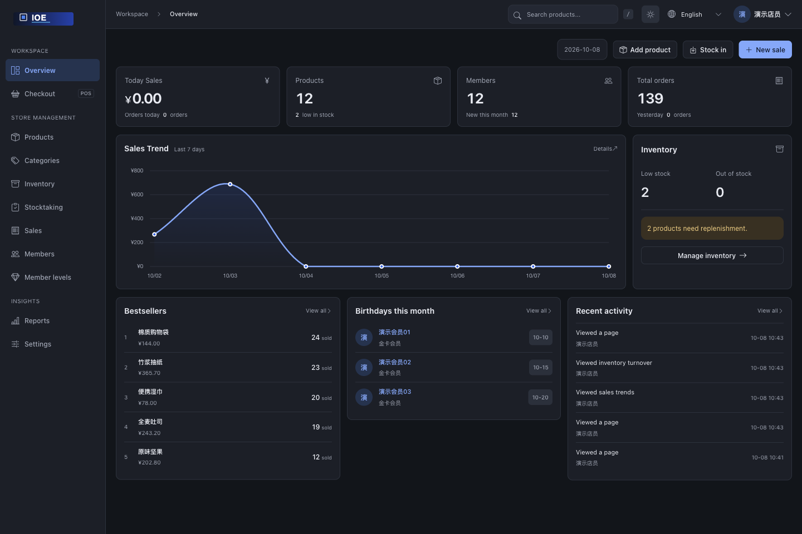

<div align="center">
  

# IOE · Inventory & Checkout

Products, stock, checkout, and member accounts in one place.

<p>
  <a href="https://github.com/zhtyyx/ioe/stargazers"></a>
  <a href="https://github.com/zhtyyx/ioe/forks"></a>
  <a href="LICENSE"></a>
  <a href="requirements.txt"></a>
  <a href="requirements.txt"></a>
  <a href="https://github.com/users/zhtyyx/packages/container/package/ioe"></a>
</p>

[简体中文](README_zh.md) · [Features](#features) · [Screenshots](#preview) · [Quick start](#quick-start) · [Star history](#star-history)

</div>

<table align="center">
  <tr>
    <td width="65%">
      <strong>✉️ Contact the author</strong><br />
      Share feedback, report an issue, or discuss customisation.<br /><br />
      <a href="mailto:zhtyyx@gmail.com">zhtyyx@gmail.com</a><br />
      <a href="https://github.com/zhtyyx/ioe/issues">Report an issue</a>
    </td>
    <td width="35%" align="center">
      <a href="asset/wxqun.png"></a><br />
      <sub>Scan to connect on WeChat</sub>
    </td>
  </tr>
</table>

IOE is a self-hosted application for small retail stores, built with Django and SQLite by default. Run it on your own computer or server to manage daily stock movements and checkout. The current open-source version operates as a single store; inventory and orders are not separated by branch.

Screenshots were refreshed on 2026-10-08 with the current logo and local demo data. Sample product and member names remain in Chinese in the English interface.


<a id="features"></a>

## 🧩 Everyday workflows

| Area | What you can do |
| --- | --- |
| 📦 Products & stock | Maintain categories, barcodes, prices, variants, and images; record receipts, withdrawals, adjustments, and low-stock alerts. |
| 🛒 Checkout | Scan or search for products, adjust quantities and prices, apply member discounts, and record payment methods and sale items. |
| 👥 Members | Manage membership levels, recharges, balances, and points; review purchases and birthday reminders. |
| 📊 Reports & stocktaking | Review sales trends, stock turnover, and member analysis; create stocktakes and reconcile counted quantities. |
| ⚙️ Administration | Manage permissions, operation logs, and backups; switch between Chinese and English or light and dark themes. |

<a id="preview"></a>

## 🖥️ Interface preview

### Checkout

Search for products to build the cart. Member lookup, payment methods, and the amount due sit alongside the item list for review before checkout.


### Sales trends

Review revenue, costs, profit, and order counts by date, with daily details below the chart.


<details>
<summary><strong>Products & inventory</strong></summary>

| Product catalogue | Product editor |
| --- | --- |
| [](asset/ioe_products_en.png) | [](asset/ioe_product_form_en.png) |

| Inventory | Stocktaking |
| --- | --- |
| [](asset/ioe_inventory_en.png) | [](asset/ioe_stocktaking_en.png) |

</details>

<details>
<summary><strong>Members & reports</strong></summary>

| Members | Membership levels |
| --- | --- |
| [](asset/ioe_members_en.png) | [](asset/ioe_member_levels_en.png) |

| Report centre | Inventory turnover |
| --- | --- |
| [](asset/ioe_reports_en.png) | [](asset/ioe_inventory_turnover_en.png) |

</details>

<details>
<summary><strong>Dark theme</strong></summary>



</details>

<a id="quick-start"></a>

## 🚀 Quick start

### Deploy a prebuilt image

Deploy without downloading the source or building on your server. The public [GHCR image](https://github.com/users/zhtyyx/packages/container/package/ioe) supports **Linux AMD64 / ARM64** and can be pulled without signing in to GitHub:

```bash
docker pull ghcr.io/zhtyyx/ioe:latest
```

For a first deployment, follow the [image deployment guide](README.docker_en.md) to download the Compose configuration and `.env` template, set your secret key and allowed hosts, start the services, and create an administrator. The database, uploads, and backups use separate persistent volumes and survive container recreation.

[GitHub Actions](.github/workflows/publish-image.yml) runs tests, verifies deployment, and publishes `latest` after pushes to `main`. Pushing a `v*` version tag publishes a versioned image. To update an existing configured deployment, back up your data and run:

```bash
docker compose pull
docker compose up -d --force-recreate --wait
```

[](https://github.com/zhtyyx/ioe/actions/workflows/publish-image.yml)

### Run from source

Use Python 3.10 or newer. The commands below are for macOS / Linux. SQLite is the default, so no separate database server is needed.

1. Clone the project and create a virtual environment:

   ```bash
   git clone https://github.com/zhtyyx/ioe.git
   cd ioe
   python3 -m venv .venv
   source .venv/bin/activate
   ```

2. Install dependencies, initialise the database, and create a login account:

   ```bash
   python -m pip install -r requirements.txt
   python -c "from pathlib import Path; Path('db').mkdir(exist_ok=True)"
   python manage.py migrate
   python manage.py createsuperuser
   ```

3. Start the local server:

   ```bash
   python manage.py runserver
   ```

Open <http://127.0.0.1:8000/> and sign in with the account you just created. A new installation starts with an empty database; the demo data shown here is not imported automatically.

On Windows, use `python` in place of `python3` and activate the virtual environment with `.venv\Scripts\activate`.

The database is stored in `db/db.sqlite3`, and uploaded files are stored in `media/`. Use `runserver` for local development. For containers, persistent storage, and deployment considerations, see the [Docker guide](README.docker_en.md).

## 🛠️ Development & contributions

Run the full test suite:

```bash
python manage.py test --settings=inventory.test_settings
```

This configuration uses a separate temporary database and file directories. Tests cover checkout, member balances, stock movements, concurrent withdrawals, and backup restoration.

Application code lives in `inventory/`: `models/` defines data structures, `views/` and `services/` handle business logic, `templates/` and `static/` provide the interface, and `tests/` contains the test suite. Documentation screenshots live in `asset/`.

Use [Issues](https://github.com/zhtyyx/ioe/issues) to report bugs or propose features. Pull requests should describe the trigger, expected behaviour, and validation. Include tests for business changes and screenshots for interface changes. Discuss the use case and scope before starting a large feature.

<a id="star-history"></a>

## ⭐ Star history

If IOE is useful to you, consider starring the repository, reporting an issue, or contributing a change.

<a href="https://www.star-history.com/#zhtyyx/ioe&amp;Date">
  <picture>
    <source media="(prefers-color-scheme: dark)" srcset="https://api.star-history.com/svg?repos=zhtyyx/ioe&amp;type=Date&amp;theme=dark" />
    <source media="(prefers-color-scheme: light)" srcset="https://api.star-history.com/svg?repos=zhtyyx/ioe&amp;type=Date" />
    
  </picture>
</a>

Chart provided by [Star History](https://www.star-history.com/#zhtyyx/ioe&Date). Click to explore the interactive timeline.

<details>
<summary><strong>☕ Support maintenance</strong></summary>

You can also support ongoing maintenance using the options below.

<div align="center">
  
  
</div>

</details>

## 🤝 Acknowledgements

Thanks to the [Linux DO community](https://linux.do/).

## 📄 License

IOE is available under the [MIT License](LICENSE). You may use, modify, and distribute it under the licence terms.
