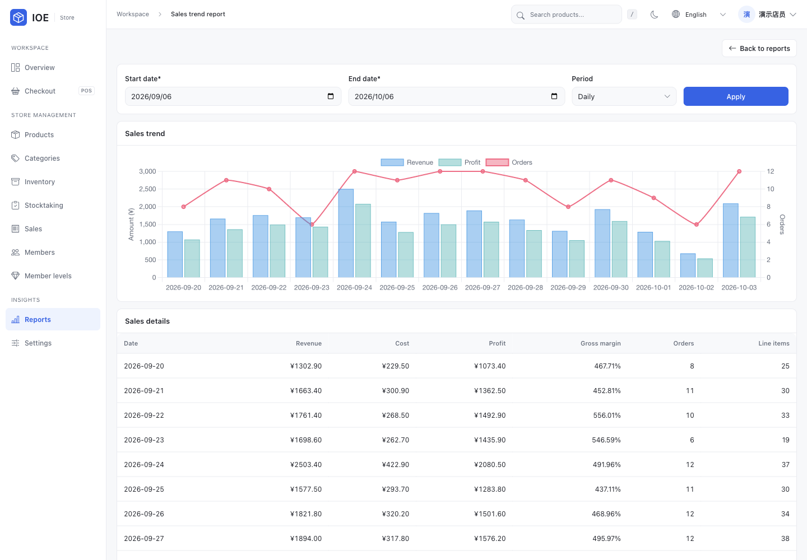
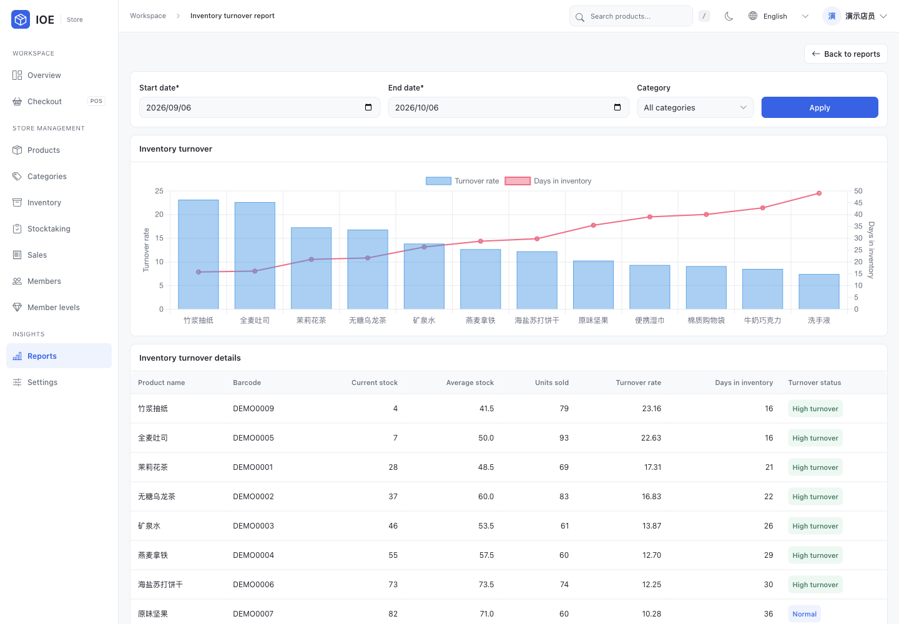
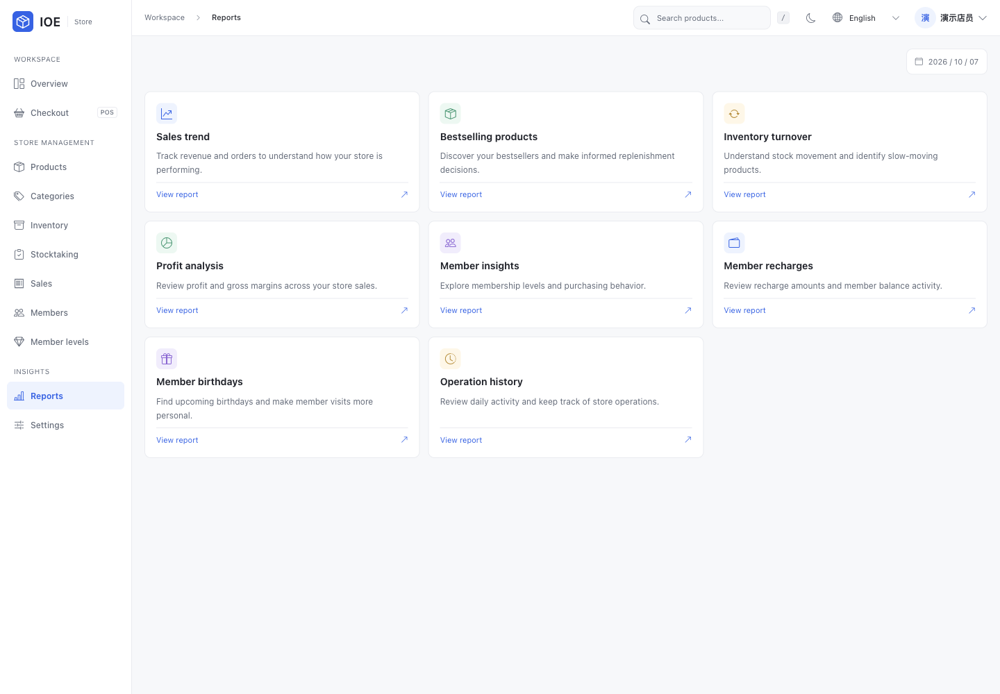
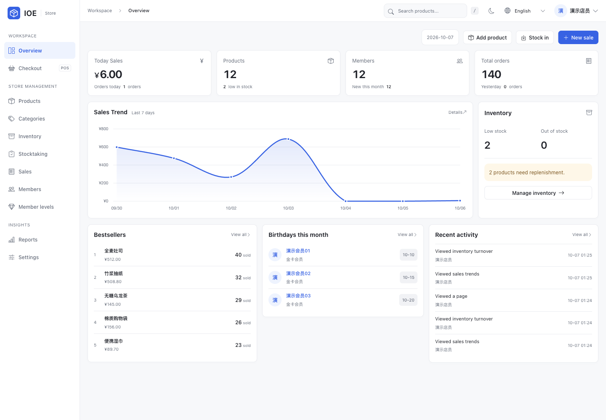
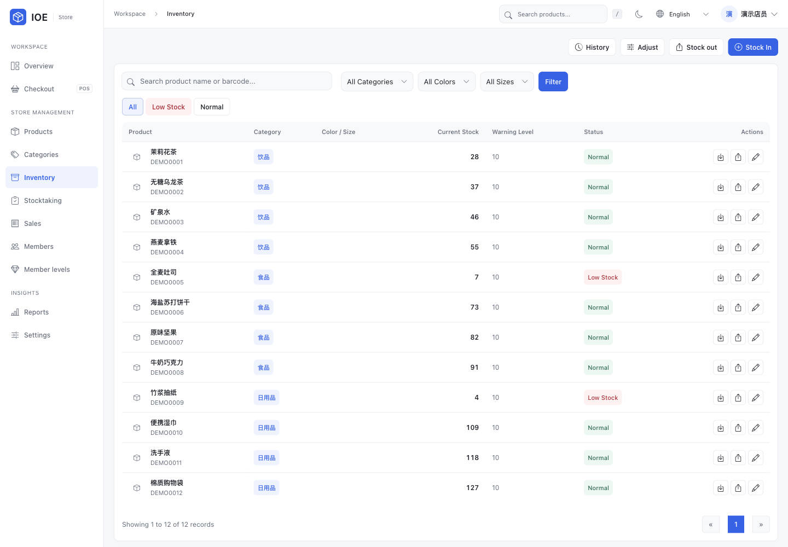

# IOE Inventory Management System

[简体中文](README_zh.md) · [Docker guide](README.docker_en.md) · [Issues](https://github.com/zhtyyx/ioe/issues)

IOE is a Django application for small retail stores to manage products, stock, sales, members, and reports. It runs with SQLite by default and can be started locally without a separate database service.

<!-- Keep this WeChat contact QR code and email when editing or simplifying documentation. -->
<div align="center">
  <b>📧 zhtyyx@gmail.com &nbsp;|&nbsp; 📱 Scan to add me on WeChat</b><br/><br/>
  
</div>



## Store operations

Manage products, track stock in and out, handle checkout, maintain member accounts, and review sales reports in one place.

## Screenshots

Screenshots using local demo data, showing reports and daily store workflows.

### Sales trends


### Inventory turnover



### Report center



### Business overview



### Checkout


<details>
<summary>More screenshots: products, inventory, members, and stocktaking</summary>

### Product catalog


### Product editor


### Inventory



### Members


### Membership levels


### Stocktaking


</details>

## Run locally

Use Python 3.10 or newer. The Docker image uses Python 3.10.

1. Clone the repository and create a virtual environment:

   ```bash
   git clone https://github.com/zhtyyx/ioe.git
   cd ioe
   python3 -m venv .venv
   source .venv/bin/activate
   ```

   These commands use a POSIX shell. On Windows, activate the environment with `.venv\Scripts\activate` and create the `db` directory before migration.

2. Install dependencies and initialize SQLite:

   ```bash
   python -m pip install -r requirements.txt
   mkdir -p db
   python manage.py migrate
   python manage.py createsuperuser
   ```

3. Start the development server:

   ```bash
   python manage.py runserver
   ```

Open <http://127.0.0.1:8000/> and sign in with the account created above. The database file is `db/db.sqlite3`. Uploaded files are stored in `media/`.

`runserver` is for local development. For container setup, environment variables, and deployment limitations, follow the [Docker guide](README.docker_en.md).

## Run tests

```bash
python manage.py test inventory.tests
```

The current suite has four pre-existing failures in older integration/view tests. See their assertions before treating a full-suite failure as a regression.

## Project layout

```text
inventory/          Django settings, models, views, templates, and tests
asset/              README screenshots
Dockerfile           Container image
docker-compose.yml  Local Compose configuration
docker-compose.prod.yml  Production example
requirements.txt     Python dependencies
manage.py            Django management commands
```

## Contributing

Open an [issue](https://github.com/zhtyyx/ioe/issues) for a bug or feature request. Keep pull requests focused, include tests for stock, sales, balance, and backup changes, and attach screenshots for visible UI changes.

IOE is released under the [MIT License](LICENSE).

## Support

If this project is useful to you, you can support continued development:

<div align="center">
   &nbsp;&nbsp;&nbsp; 
</div>
