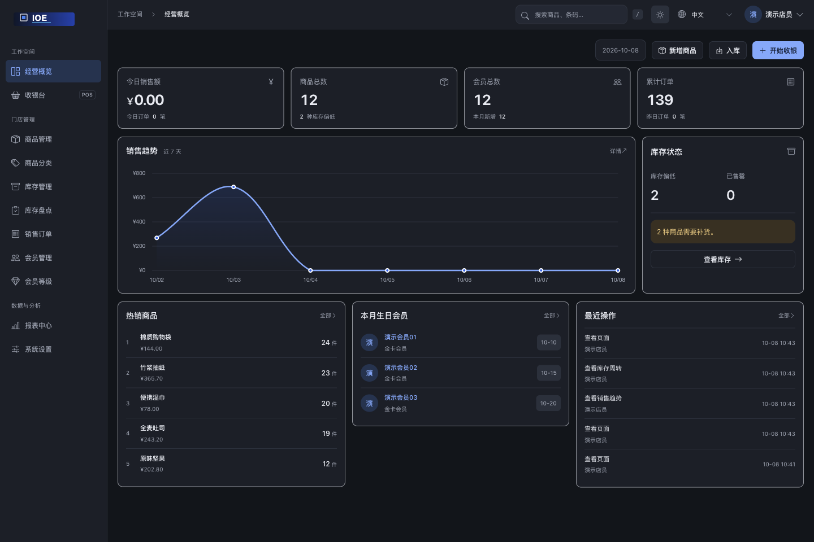

<div align="center">
  

# IOE · 单店进销存与收银

商品、库存、收银和会员，在同一套系统里管理。

<p>
  <a href="https://github.com/zhtyyx/ioe/stargazers"></a>
  <a href="https://github.com/zhtyyx/ioe/forks"></a>
  <a href="LICENSE"></a>
  <a href="requirements.txt"></a>
  <a href="requirements.txt"></a>
  <a href="https://github.com/users/zhtyyx/packages/container/package/ioe"></a>
</p>

[English](README.md) · [功能](#features) · [界面预览](#preview) · [快速开始](#quick-start) · [Star 趋势](#star-history)

</div>

<table align="center">
  <tr>
    <td width="65%">
      <strong>✉️ 联系作者</strong><br />
      交流使用体验、反馈问题，或讨论二次开发。<br /><br />
      <a href="mailto:zhtyyx@gmail.com">zhtyyx@gmail.com</a><br />
      <a href="https://github.com/zhtyyx/ioe/issues">问题反馈</a>
    </td>
    <td width="35%" align="center">
      <a href="asset/wxqun.png"></a><br />
      <sub>微信扫码联系</sub>
    </td>
  </tr>
</table>

IOE 面向小型零售门店，基于 Django 构建，默认使用 SQLite。你可以在自己的电脑或服务器上运行，管理从入库到收银的日常业务。当前开源版按单店使用，库存和订单尚未按门店隔离。

下方截图于 2026-10-08 使用本地演示数据重新拍摄，已更新为当前 Logo。


<a id="features"></a>

## 🧩 日常业务

| 场景 | 可以完成的操作 |
| --- | --- |
| 📦 商品与库存 | 维护分类、条码、价格、规格和图片；记录出入库、调整库存、查看低库存提醒。 |
| 🛒 门店收银 | 扫码或搜索商品，调整数量和单价，应用会员折扣，记录支付方式与销售明细。 |
| 👥 会员管理 | 维护会员等级、充值、余额和积分，查询消费记录与生日提醒。 |
| 📊 报表与盘点 | 查看销售趋势、库存周转及会员分析；创建盘点任务，核对账面与实盘数量。 |
| ⚙️ 系统管理 | 管理用户权限、操作日志和数据备份；切换中英文及浅色、深色主题。 |

<a id="preview"></a>

## 🖥️ 界面预览

### 收银台

搜索商品后直接加入清单，会员查找、支付方式和应付金额集中在右侧，便于核对后结账。


### 销售趋势

按日期查看销售额、成本、利润和订单数量，图表下方保留每日明细。


<details>
<summary><strong>商品与库存</strong></summary>

| 商品列表 | 商品编辑 |
| --- | --- |
| [](asset/ioe_products_zh.png) | [](asset/ioe_product_form_zh.png) |

| 库存管理 | 库存盘点 |
| --- | --- |
| [](asset/ioe_inventory_zh.png) | [](asset/ioe_stocktaking_zh.png) |

</details>

<details>
<summary><strong>会员与报表</strong></summary>

| 会员管理 | 会员等级 |
| --- | --- |
| [](asset/ioe_members_zh.png) | [](asset/ioe_member_levels_zh.png) |

| 报表中心 | 库存周转 |
| --- | --- |
| [](asset/ioe_reports_zh.png) | [](asset/ioe_inventory_turnover_zh.png) |

</details>

<details>
<summary><strong>深色主题</strong></summary>



</details>

<a id="quick-start"></a>

## 🚀 快速开始

### 直接部署镜像

无需下载源码或在服务器上构建镜像。[GHCR 镜像](https://github.com/users/zhtyyx/packages/container/package/ioe)公开提供，支持 **Linux AMD64 / ARM64**，无需登录 GitHub 即可拉取：

```bash
docker pull ghcr.io/zhtyyx/ioe:latest
```

首次部署请按 [镜像部署指南](README.docker_zh.md) 下载 Compose 配置和 `.env` 模板，填写密钥及访问地址，再启动服务并创建管理员。数据库、上传文件和备份保存在独立数据卷中，重建容器后仍会保留。

[GitHub Actions](.github/workflows/publish-image.yml) 会在推送到 `main` 后自动运行测试、验证部署并发布 `latest`；推送 `v*` 版本标签时发布对应版本镜像。已完成配置的部署可这样更新（更新前先备份数据）：

```bash
docker compose pull
docker compose up -d --force-recreate --wait
```

[](https://github.com/zhtyyx/ioe/actions/workflows/publish-image.yml)

### 从源码运行

使用 Python 3.10 或更高版本。以下命令适用于 macOS / Linux；默认数据库为 SQLite，无需另外启动数据库服务。

1. 克隆项目并创建虚拟环境：

   ```bash
   git clone https://github.com/zhtyyx/ioe.git
   cd ioe
   python3 -m venv .venv
   source .venv/bin/activate
   ```

2. 安装依赖，初始化数据库并创建登录账号：

   ```bash
   python -m pip install -r requirements.txt
   python -c "from pathlib import Path; Path('db').mkdir(exist_ok=True)"
   python manage.py migrate
   python manage.py createsuperuser
   ```

3. 启动本地服务：

   ```bash
   python manage.py runserver
   ```

打开 <http://127.0.0.1:8000/>，使用刚创建的账号登录。首次运行是空数据库，README 中的演示数据不会自动导入。

Windows 用户可将 `python3` 换成 `python`，并使用 `.venv\Scripts\activate` 激活虚拟环境。

数据库保存在 `db/db.sqlite3`，上传的商品图片等文件保存在 `media/`。`runserver` 用于本地开发；容器部署、持久化配置与部署注意事项见 [Docker 部署指南](README.docker_zh.md)。

## 🛠️ 开发与贡献

运行完整测试集：

```bash
python manage.py test --settings=inventory.test_settings
```

测试配置使用独立的临时数据库与文件目录，覆盖收银、会员余额、库存变动、并发扣库存和备份恢复等流程。

主要代码位于 `inventory/`：`models/` 定义数据结构，`views/` 和 `services/` 处理业务，`templates/` 与 `static/` 提供界面，`tests/` 保存测试。`asset/` 存放文档截图。

欢迎通过 [Issues](https://github.com/zhtyyx/ioe/issues) 反馈问题或提出功能建议。提交 PR 时请说明触发条件、预期行为和验证结果；业务改动附测试，界面改动附截图。较大的功能先讨论使用场景和范围。

<a id="star-history"></a>

## ⭐ Star 趋势

如果 IOE 对你有用，欢迎点一个 Star，也欢迎提交 Issue 和改进代码。

<a href="https://www.star-history.com/#zhtyyx/ioe&amp;Date">
  <picture>
    <source media="(prefers-color-scheme: dark)" srcset="https://api.star-history.com/svg?repos=zhtyyx/ioe&amp;type=Date&amp;theme=dark" />
    <source media="(prefers-color-scheme: light)" srcset="https://api.star-history.com/svg?repos=zhtyyx/ioe&amp;type=Date" />
    
  </picture>
</a>

图表由 [Star History](https://www.star-history.com/#zhtyyx/ioe&Date) 提供，点击可查看交互趋势。

<details>
<summary><strong>☕ 支持维护</strong></summary>

也可以通过以下方式支持项目维护。

<div align="center">
  
  
</div>

</details>

## 🤝 致谢

感谢 [Linux DO 社区](https://linux.do/)。

## 📄 许可证

IOE 采用 [MIT License](LICENSE)，可按许可证条款使用、修改和分发。
